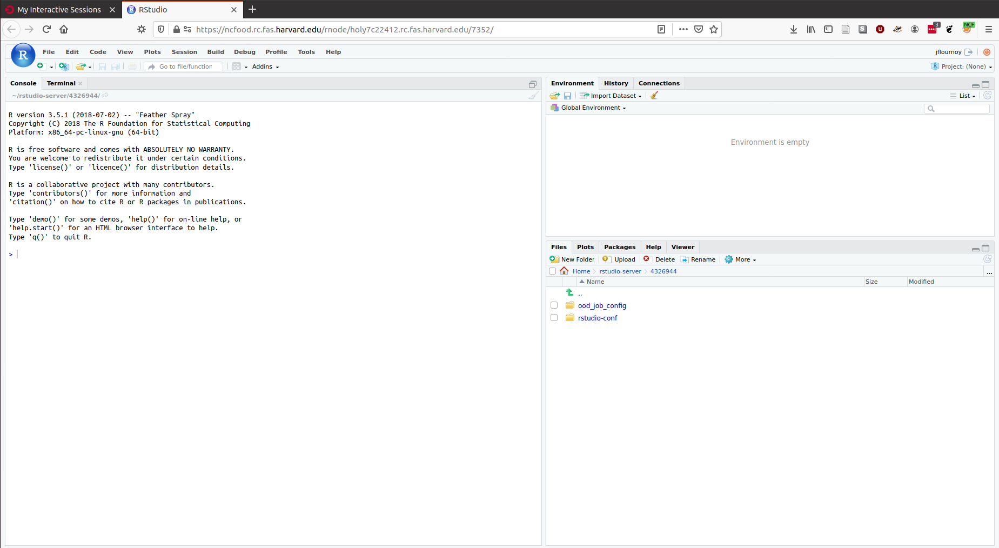

# Setting up your R Studio instance

1. In your web browser, go to https://ncfood.rc.fas.harvard.edu/.
2. In the top toolabr on this page, click "Interactive Apps" and select "Rstudio Server (new)".
3. Set the options to something reasonable. Here's what I recommend for now
  - **Partition:** ncf
  - **Memory Allocation in GB:** 16
  - **Number of cores:** 1
  - **Number of GPUs:** 0
  - **Number of hours:** 4
  - **R version to be loaded with Rstudio:** _R/3.5.1-fasrc02 Comp gcc_
  - **location of your R_LIBS_USER folder:** ~/R_3.5.1_GCC/
4. Leave the rest blank and click "Launch".

This will take you to a new page where you will see a list of interactive apps on the left, and hopefully, in the main body of the page, you will see that your job is starting. Once it has started a button will appear saying "Connect to RStudio Server" and "Delete". Click the "Connect" button, which will open a new window onto your R Studio Server session:

Now we're going to write a simple script to simulate some data, and estimate a model using those data. It's in this repository, and it's called [run_simulations.R](run_simulations.R).
