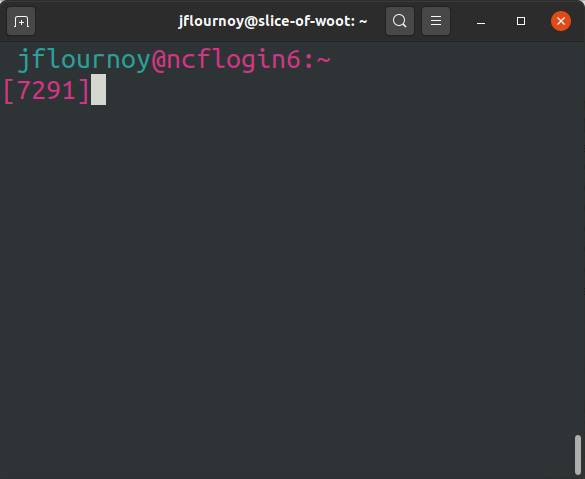

# Submitting the batch job

Now that you've your written and tested your code interactively with R Studio, you can return to the command line and submit the job to the SLURM cluster.

1. Return to your terminal window, where you're logged into NCF.
  
2. Make sure you're in the correct directory that contains both the bash script and the R script. If you pulled this repository into your home directory, you can simply execute `cd ~/ncf_r_example`.
3. Double check that the bash script is really the one you want to run: `cat batch_simulations.bash`. For longer files you could use `less batch_simulations.bash`.
4. To submit the job, run `sbatch batch_simulations.bash`. You should see something like:
  ```
   jflournoy@ncflogin6:~/ncf_r_example
  [7296]sbatch batch_simulations.bash 
  Submitted batch job 4335800
  ```
5. To check its progress, run `sacct`, which gives you the status of all the jobs you've run today.
6. To follow along the progress being printed to the log file (all the `message` commands you've written and other stuff), you can use `tail -f sims_example_*.out`. You can replace `*` with whatever the job number is if you want to be very specific.
